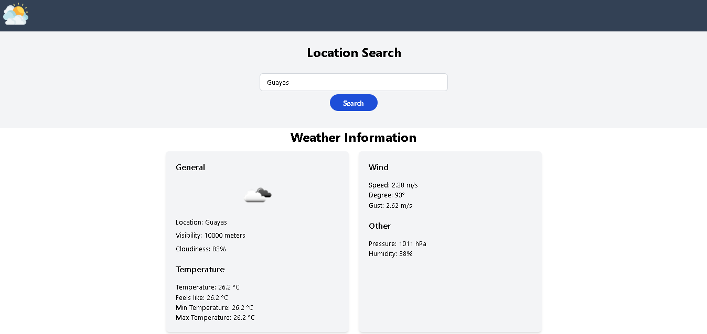

# Weather App

This is a simple weather application built with React. It allows users to search for weather information based on location (city, state, or ZIP code).

## Features

- Search for weather information by location.
- Display detailed weather information including temperature, wind speed, humidity, etc.
- Responsive design for a seamless experience across different devices.

## Technologies Used

- React
- JavaScript (ES6+)
- CSS (Tailwind CSS)
- OpenWeatherMap API

## Getting Started

To get a local copy of the project up and running, follow these steps:

1. Clone the repository to your local machine:
git clone https://github.com/your-username/weather-app.git

2. Navigate to the project directory:
cd weather-app

3. Install dependencies:
npm install

4. Create a `.env` file in the root directory and add your OpenWeatherMap API key:
REACT_APP_API_KEY=your-api-key

5. Start the development server:
npm start

6. Open your browser and navigate to `http://localhost:3000` to view the application.
## API Key

!!!This project uses the OpenWeatherMap API to fetch weather data. You'll need to sign up for an API key [here](https://home.openweathermap.org/users/sign_up) if you haven't already. After obtaining your API key, add it to the `.env` file as shown in the "Getting Started" section!!!

## License

This project is licensed under the MIT License. See the [LICENSE](LICENSE) file for details.

## Results App

